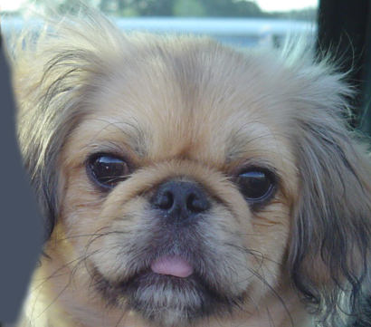

# Filters, convolution, and cross-correlation

## Part 1. Convolutions

### Task #1

Implement `conv_nested` function that is a naive implementation of convolution which uses 4 nested for-loops. It takes an image `I` and a kernel `k` as inputs and outputs the convolved image `f○h` that has the same shape as the input image. Assume that pixels that outside of source images borders have intensity 0. Test your `conv_nested` function on a real image using gaussian kernel (3x3).

## Part 2. Cross-correlation

### Task #2

Cross-correlation can be used to look for templates in images. Implement finding the template on the shelf using cross-correlation.

`Note!` The template is located in the 1st row of the shelf (the 2nd element from the left).

`Question.` Is it able to detect the template correctly?

  
Answer

  
  _No, it cannot properly detect the template. The actual location of the template is far away ..._

---

  
  

    <b>Figure 1.</b>
    <i>Shelf (with cereals for a good breakfast)</i>
  

  
  

    <b>Figure 2.</b>
    <i>Template (favorite)</i>
  

### Task #3 (optional)
In previous task try implementing zero-mean cross-correlation (subtract the mean value of the template so that it has zero mean).

  
Solution

  
  See [find favorite examples](examples/find_favorite.ipynb).

### Task #4 (optional)
Modify the algorithm for cases of a variable light conditions using __normalized cross-correlation__ (normalize the pixels of the image and template at every step before comparing them). Test on dark shelf.

  
  

    <b>Figure 3.</b>
    <i>Dark shelf (everything has its dark side)</i>
  

  
Solution

  
  See [find_favorite examples](examples/find_favorite.ipynb).
  
  _In this case the match is correct._

## Part 3. Hybrid images

## Task #5

We want to construct the image convolution function (i.e. image filtering) and use it to create a **hybrid image**. The technique was invented by [Oliva, Torralba, and Schyns in 2006](http://cvcl.mit.edu/publications/OlivaTorralb_Hybrid_Siggraph06.pdf). High frequency image content tends to dominate perception but, at a distance, only low frequency (smooth) content is perceived. By blending high and low frequency content, we will be able to create a hybrid image that is perceived differently at different distances.
A hybrid image is the sum of a **low-pass filtered** version of a first image and a **high-pass filtered** version of a second image. Use free parameter (cut-off frequency) for each image pair to control how much high frequency to remove from the first image and how much low frequency to leave in the second image.

**HYBRID IMAGE EXAMPLE**

   |  
:-------------------------:|:-------------------------:
**Figure 4.** _Nice, worm, and beautiful cat_ | **Figure 5.** _Confident, happy, and friendly dog_

   |  
:-------------------------:|:-------------------------:
**Figure 6.** _High frequencies of the cat_ | **Figure 7.** _Low frequencies of the dog_

Adding the high and low frequencies together gives the hybrid image. If you're having trouble seeing the multiple interpretations of the image, a useful way to visualize the effect is by progressively downsampling the hybrid image:

  
  

    <b>Figure 8.</b>
    <i>Downsampled hybrid images of a CatDog</i>
  

